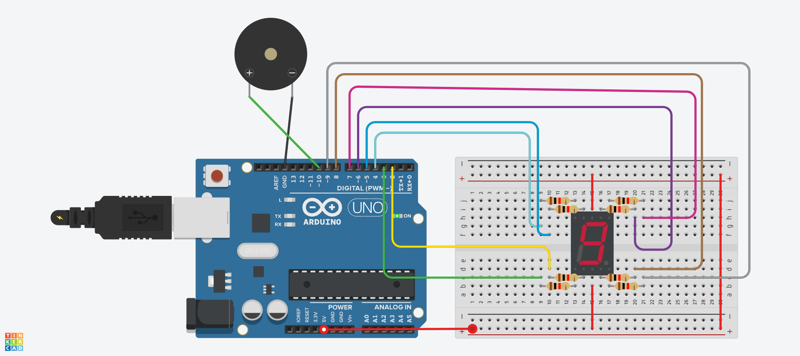

# 7 segment 예제 1
## 7 segment로 알람만들기

.


```c
int index = 0;
int counter;

String pattern[] = {
  "00100001",    //해당패턴은 0~9를 나타내는 8비트 패턴이다.
  "11111001",    //0은 LOW로 LED on이 된다.
  "00010011",    //1은 HIGH로 LED off가 된다.
  "01010001",
  "11010001",
  "01001001",
  "00000101",
  "11110001",
  "00000001",
  "01000001",
};

void clear() {
  index = 0;
  for (counter = 0; counter < 8; ++counter) {
    analogWrite(index + 2, 255); // 디지털 핀 2~9 HIGH
    index++;
  }
}

void display(int num) {
  clear();
  index = 0;
  for (counter = 0; counter < 8; ++counter) {
    if (pattern[num].substring(index, index + 1) == "0") {
      analogWrite(index + 2, 0);  // 핀 LOW 출력
    }
    index++;
  }
}

void setup() {
  pinMode(2, OUTPUT);
  pinMode(3, OUTPUT);
  pinMode(4, OUTPUT);
  pinMode(5, OUTPUT);
  pinMode(6, OUTPUT);
  pinMode(7, OUTPUT);
  pinMode(8, OUTPUT);
  pinMode(9, OUTPUT);

  display(9); delay(1000);
  display(8); delay(1000);
  display(7); delay(1000);
  display(6); delay(1000);
  display(5); delay(1000);
  display(4); delay(1000);
  display(3); delay(1000);
  display(2); delay(1000);
  display(1); delay(1000);
  display(0); delay(1000);

  tone(10, 523, 500); // 핀 10에서 523Hz 소리를 0.5초 동안 발생
}

void loop() {
}


```
