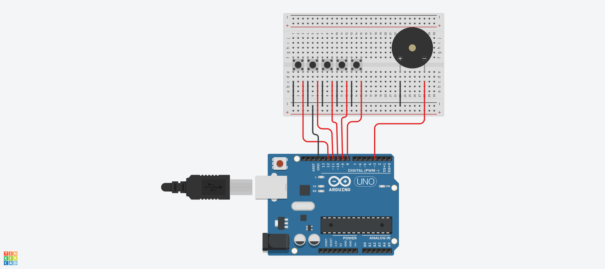

# 부저 예제 1
## 부저로 피아노 만들기

.


```c

#define PIEZO_BUZZER 3
#define SW1 12
#define SW2 11
#define SW3 10
#define SW4 9
#define SW5 8

void setup() {
  pinMode(SW1, INPUT_PULLUP);
  pinMode(SW2, INPUT_PULLUP);
  pinMode(SW3, INPUT_PULLUP);
  pinMode(SW4, INPUT_PULLUP);
  pinMode(SW5, INPUT_PULLUP);
}

void loop() {
  if (digitalRead(SW1) == 0) tone(PIEZO_BUZZER, 262, 1000);
  else if (digitalRead(SW2) == 0) tone(PIEZO_BUZZER, 294, 1000);
  else if (digitalRead(SW3) == 0) tone(PIEZO_BUZZER, 330, 1000);
  else if (digitalRead(SW4) == 0) tone(PIEZO_BUZZER, 349, 1000);
  else if (digitalRead(SW5) == 0) tone(PIEZO_BUZZER, 392, 1000);
  else noTone(PIEZO_BUZZER);
}

```
