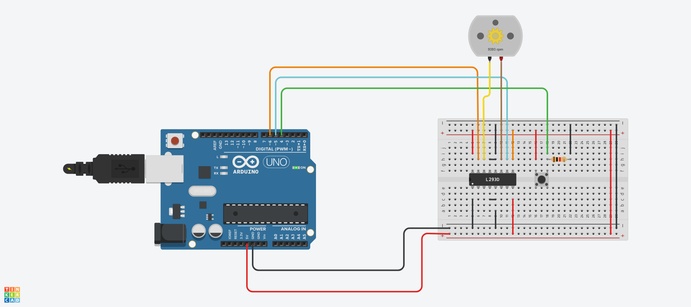
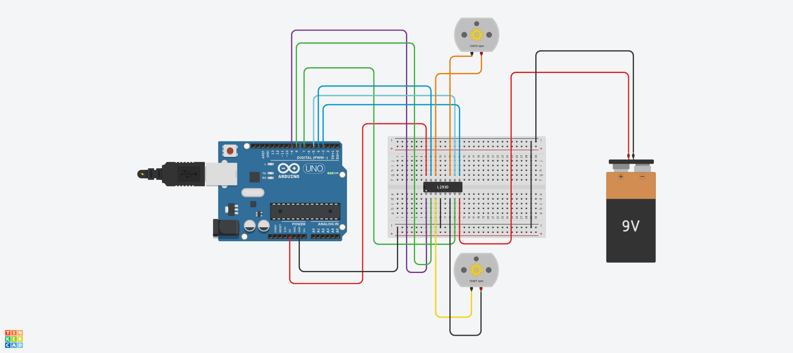

# DC 예제 1
## DC 모터 가변저항으로 제어하기

.

```c
void setup()
{
  	pinMode(9,OUTPUT);      // 9핀을 출력으로 설정
}
void loop()
{
  Serial.begin(9600);      // 시리얼 통신 시작(속도는 9600bps로 설정)
  int inputValue = analogRead(A0);    // A0 핀에서 아날로그 입력값(0~1023) 읽기
  Serial.println(inputValue);         // 읽은 값을 시리얼 모니터에 출력
  int convertedValue = map(inputValue, 0, 1023, 0, 255);  // 0~1023 범위를 0~255범위로 변환
  
  analogWrite(9, convertedValue);  // 변환된 값을 9번핀에 아날로그 출력
  delay(100);          // 0.1초간 딜레이
}

```


# DC 예제 2
## DC 모터 푸쉬버튼으로 방향 제어하기

.


```c
const int MOTOR_PIN_A = 5;  // 5,6번핀을 모터를 제어할 PWM출력핀으로 선언한다.
const int MOTOR_PIN_B = 6;  // 5번을 핀A, 6번을 핀B라고 선언한다.

void setup()
{
  pinMode(MOTOR_PIN_A, OUTPUT);  //핀A와 핀B는 출력으로 설정한다.
  pinMode(MOTOR_PIN_B, OUTPUT);
}

void loop()
{
  int readValue = digitalRead(4);  // 4번핀을 디지털 입력 값으로 읽어온다.

  if (readValue == LOW) {    // 만약 입력값이 LOW일경우 다음과 같은 행동을 한다.
    analogWrite(MOTOR_PIN_A, 255);  // 핀a방향으로 최대속도로 회전시킨다
    analogWrite(MOTOR_PIN_B, 0);    // 핀b방향은 정지시킨다.
  }
  else {        // 만약 반대의 상황이라면 다음과 같은 행동을 한다,
    analogWrite(MOTOR_PIN_A, 0);  // 핀a방향으로 정지시킨다.
    analogWrite(MOTOR_PIN_B, 255);  // 핀b방향으로 최대속도로 회전시킨다.
  }

  delay(100); // 이 루프의 마지막에 0.1초의 딜레이를 준다.
}


```


# DC 예제 3
## 2개의 DC 모터 방향 및 속도 제어하기

.

```c

// Motor A connections
int enA = 9;  // 모터a의 속도제어는 9번핀
int in1 = 8;  // 모터a의 방향제어는 8,7번핀
int in2 = 7;

// Motor B connections
int enB = 3; // 모터b의 속도제어는 3번핀
int in3 = 5; // 모터b의 방향제어는 5,4번핀
int in4 = 4;

void setup() {
  // Set all the motor control pins to outputs
  pinMode(enA, OUTPUT);  //모든 핀을 output으로 설정
  pinMode(enB, OUTPUT);  
  pinMode(in1, OUTPUT);
  pinMode(in2, OUTPUT);
  pinMode(in3, OUTPUT);
  pinMode(in4, OUTPUT);

  // Turn off motors - Initial state
  digitalWrite(in1, LOW);  // 모든 모터는 처음에는 정지상태로 설정
  digitalWrite(in2, LOW);
  digitalWrite(in3, LOW);
  digitalWrite(in4, LOW);
}

void loop() {          //다음과 같은 행동은 반복한다.
  directionControl();  //모터 방향전환 테스트 함수
  delay(1000);        // 1초 딜레이
  speedControl();    // 속도 조절 테스트 함수
  delay(1000);        // 1초 대기
}

// This function lets you control spinning direction of motors
void directionControl() {
  // Set motors to maximum speed (PWM 255)
  analogWrite(enA, 255);    // 모터a에 최대속도로 설정
  analogWrite(enB, 255);    // 모터b에 최대속도로 설정

  // Turn on motor A & B forward
  digitalWrite(in1, HIGH); //먼저 모터a에 정방향으로 회전
  digitalWrite(in2, LOW);
  digitalWrite(in3, HIGH);  // 모터 b도 정방향으로 회전
  digitalWrite(in4, LOW);
  delay(2000);                // 이 상태를 2초간 유지한다

  // Now change motor directions (reverse)
  digitalWrite(in1, LOW);    // a모터는 역방향으로 회전
  digitalWrite(in2, HIGH);
  digitalWrite(in3, LOW);    // b모터로 역방향으로 회전
  digitalWrite(in4, HIGH);
  delay(2000);                // 이상태를 2초간 유지

  // Turn off motors
  digitalWrite(in1, LOW);      // 모든 모터 정지
  digitalWrite(in2, LOW);
  digitalWrite(in3, LOW);
  digitalWrite(in4, LOW);
}

// This function lets you control speed of the motors
void speedControl() {
  // Turn on motors (A reverse, B reverse)
  digitalWrite(in1, LOW);
  digitalWrite(in2, HIGH); // a모터를 역방향으로 회전
  digitalWrite(in3, LOW);
  digitalWrite(in4, HIGH);  // b모터도 역방향으로 회전

  // Accelerate from 0 to 255
  for (int i = 0; i < 256; i++) {    //임의의 값 i가 0이라고 할때 i는 256이 될때까지 1씩 증가한다.
    analogWrite(enA, i);    // a모터의 속도를 0에서 255까지 점점 증가한다.
    analogWrite(enB, i);   // b모터 마찬가지로 해준다.
    delay(20);            // 속도 단계별로 0.02초씩 딜레이를 준다.
  }

  // Decelerate from 255 to 0
  for (int i = 255; i >= 0; --i) {
    analogWrite(enA, i);      // a모터가 최대속도에 도달한뒤 점차 속도가 감소한다.
    analogWrite(enB, i);      // b모터도 점차 속도가 감소한다.
    delay(20);                // 각 단계별로 0.02딜레이가 있다.
  }

  // Turn off motors
  digitalWrite(in1, LOW);      //속도가 0이되면 모든 모터는 정지한다.
  digitalWrite(in2, LOW);
  digitalWrite(in3, LOW);
  digitalWrite(in4, LOW);
}

```

