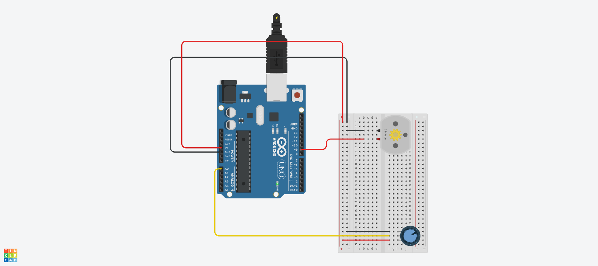

# DC 예제 1
## DC 모터 가변저항으로 제어하기

.

```c
void setup()
{
  	pinMode(9,OUTPUT);      // 9핀을 출력으로 설정
}
void loop()
{
  Serial.begin(9600);      // 시리얼 통신 시작(속도는 9600bps로 설정)
  int inputValue = analogRead(A0);    // A0 핀에서 아날로그 입력값(0~1023) 읽기
  Serial.println(inputValue);         // 읽은 값을 시리얼 모니터에 출력
  int convertedValue = map(inputValue, 0, 1023, 0, 255);  // 0~1023 범위를 0~255범위로 변환
  
  analogWrite(9, convertedValue);  // 변환된 값을 9번핀에 아날로그 출력
  delay(100);          // 0.1초간 딜레이
}

```


# DC 예제 2
## DC 모터 푸쉬버튼으로 방향 제어하기

.


```c
const int MOTOR_PIN_A = 5;  // 5,6번핀을 모터를 제어할 PWM출력핀으로 선언한다.
const int MOTOR_PIN_B = 6;  // 5번을 핀A, 6번을 핀B라고 선언한다.

void setup()
{
  pinMode(MOTOR_PIN_A, OUTPUT);  //핀A와 핀B는 출력으로 설정한다.
  pinMode(MOTOR_PIN_B, OUTPUT);
}

void loop()
{
  int readValue = digitalRead(4);  // 4번핀을 디지털 입력 값으로 읽어온다.

  if (readValue == LOW) {    // 만약 입력값이 LOW일경우 다음과 같은 행동을 한다.
    analogWrite(MOTOR_PIN_A, 255);  // 핀a방향으로 최대속도로 회전시킨다
    analogWrite(MOTOR_PIN_B, 0);    // 핀b방향은 정지시킨다.
  }
  else {        // 만약 반대의 상황이라면 다음과 같은 행동을 한다,
    analogWrite(MOTOR_PIN_A, 0);  // 핀a방향으로 정지시킨다.
    analogWrite(MOTOR_PIN_B, 255);  // 핀b방향으로 최대속도로 회전시킨다.
  }

  delay(100); // 이 루프의 마지막에 0.1초의 딜레이를 준다.
}


```
