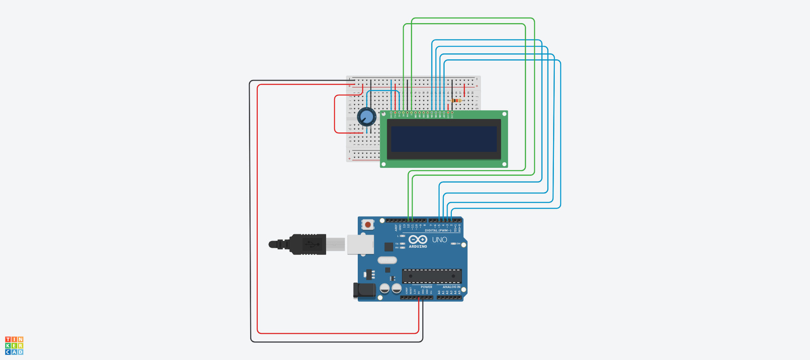
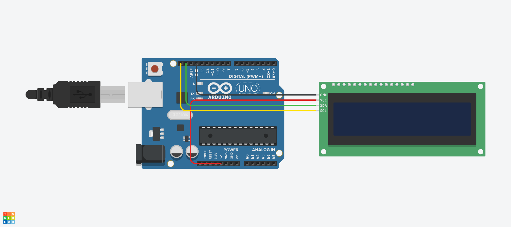

# LCD 예제 1
## LCD 16X2 출력하기

.

```c

#include <LiquidCrystal.h>        // Liquidcrystal.h 라는 패키지를 다운받아서 사용한다.

LiquidCrystal lcd(12, 11, 5, 4, 3, 2);  // 12,11, 5, 4, 3, 2번 핀을 사용할 예정이다. 

void setup()    // 이 코드는 전원이 켜질때 또는 리셋 버튼을 눌렀을때 딱 한번 작동한다.
{
  lcd.begin(16,2);  // lcd 초기화 함수로 (열, 행)을 의미한다. 즉 가로 문자 수 16칸, 세로 문자수 2칸을 배치하도록 셋팅한다는 의미이다.
  lcd.print("Hello, world!!!");  // lcd에 헬로 월드라는 문자를 출력한다.

}

void loop()
{}

```

# LCD 예제 2
## LCD 16X2 문자열 출력하기


.

```c

#include <LiquidCrystal.h>

LiquidCrystal lcd(12, 11, 5, 4, 3, 2);

void setup() {
  lcd.begin(16, 2);
  lcd.print("Hello, world!!!");
}

void loop() {
  lcd.print("Cusor ON-Blink");
  lcd.cursor();
  lcd.blink();
  delay(2000);
  lcd.clear();

  lcd.print("Cusor OFF");
  lcd.noBlink();
  lcd.cursor();
  delay(1000);
  lcd.clear();

  lcd.print("Count Up");
  delay(1000);
  lcd.clear();

  for (int k = 0; k <= 10; k++) {
    lcd.home();
    lcd.print("No : ");
    lcd.print(k);
    delay(200);
  }
  lcd.clear();

  lcd.print("Hello!");
  for (int k = 0; k < 3; k++) {
    lcd.noDisplay();
    delay(1000);
    lcd.display();
    delay(1000);
  }
  lcd.clear();

  lcd.setCursor(6, 0);
  lcd.print("Hello!");
  for (int k = 0; k < 3; k++) {
    lcd.scrollDisplayRight();
    delay(500);
  }
  lcd.clear();

  lcd.setCursor(6, 0);
  lcd.print("Hello!");
  for (int k = 0; k < 3; k++) {
    lcd.scrollDisplayLeft();
    delay(500);
  }
  lcd.clear();
}

```


# LCD 예제 3
# I2C LCD를 이용한 문자열 출력

.

```c
#include <LiquidCrystal_I2C.h>  // 라이브러리에서 LiquidCrystal_I2C.h fksms I2C를 사용하기 위한 헤더파일을 불러온다.

int seconds = 0;      // 1초를 세기위해 초를 선언해준다.

LiquidCrystal_I2C lcd_1(0x27, 16, 2); // lcd_1이라는 객체를 선언한다. 객체란 일종의 클래스로 만든 변수들, 함수들이라고 할 수 있다. 클래스는 변수들과 함수들의 포괄하여 의미한다. 즉, 함수의 변수, 함수의 함수라고 할수도 있다.
                                      // 0x27은 객체의 주소이고, 16, 2(가로 열, 세로 행)을 의미한다.  
void setup()
{
  lcd_1.init();                        // lce_1을 초기화한다.
  lcd_1.print("hello world");          // hello world라는 문자열을 출력한다.
}

void loop()                            //다음과 동작을 반복동작 한다.
{
  lcd_1.setCursor(0, 1);              // 커서를 0,1로 옮겨준다. 가로0줄, 세로 1줄로 옮겨준다.
  lcd_1.print(seconds);                // 처음 선언해준 second에 할당된 값을 출력한다.
  lcd_1.setBacklight(1);
  delay(500); // Wait for 500 millisecond(s)
  lcd_1.setBacklight(0);
  delay(500); // Wait for 500 millisecond(s)
  seconds += 1;
}

```


