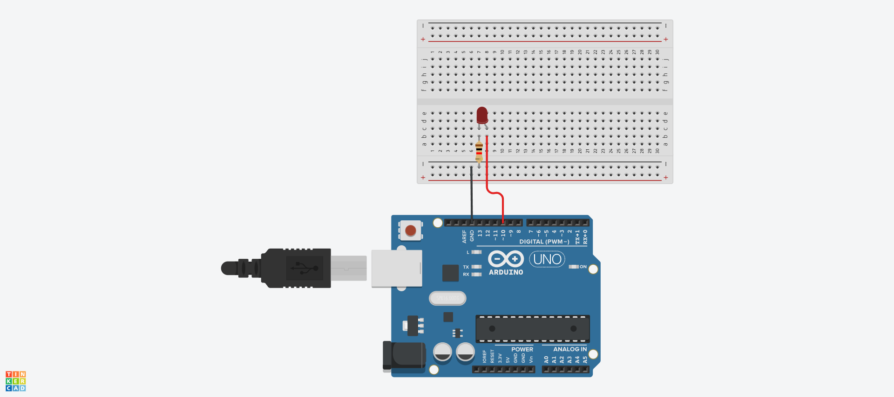
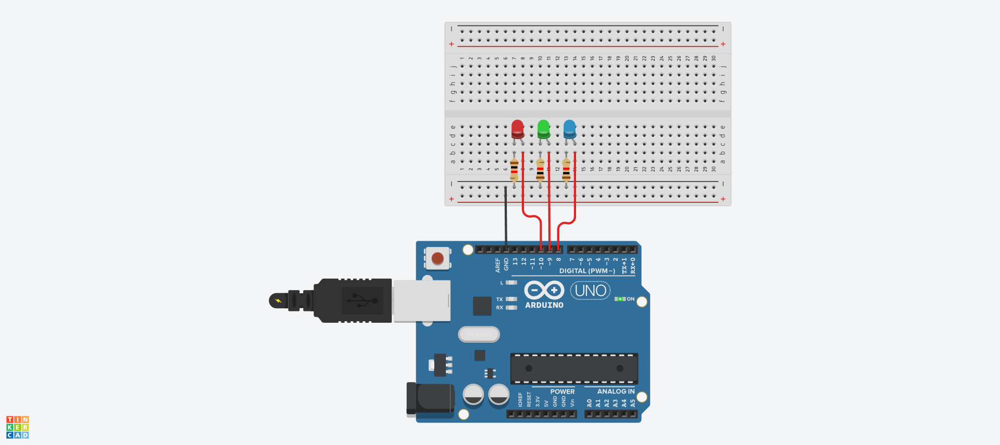
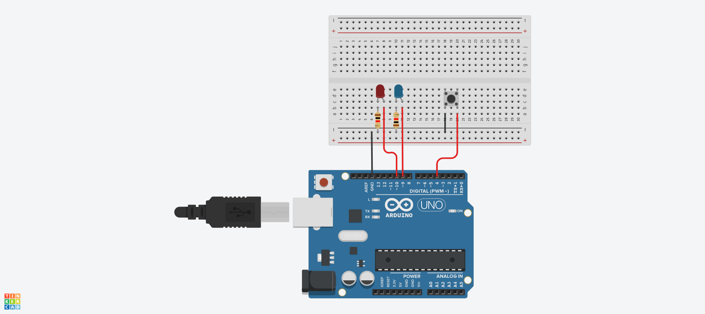
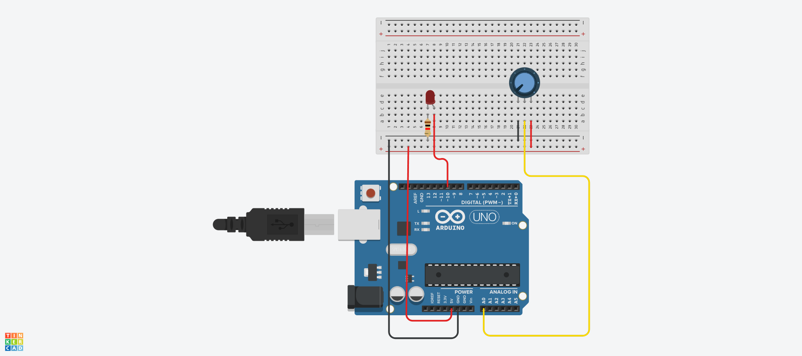

# LED 예제 1
## LED 깜빡이기
.

## source code

```c
#define LED_1 10	//define은 일종의 치환이다. 코드 전체에서 LED_!은 10으로 치환되서 읽게된다. define을 사용하면 코드를 보기 쉽고 나중에 핀 번호를 바꾸고 싶을때 바꾸기 쉽게 만들어 유지보수하기가 쉽다.

void setup()
{
	pinMode(LED_1, OUTPUT);	// LED_!을 출력 핀으로 지정한다.

}

void loop()
{
	digitalWrite(LED_1, HIGH);	// LED_1이 점등하고 소등을 0.08초 딜레이를 가지고 루프를 한다. 
	delay(80);
  	digitalWrite(LED_1, LOW);
	delay(80);
}
```

## a와 b로 LED 켜고 끄기
```c


void setup()
{
	Serial.begin(9600);	// 아두이노IDE에 저장된 함수이다.
	pinMode(10, OUTPUT);

}

void loop()
{
  if(Serial.available() > 0)	// 만약 통신이 가능하다면
  {
  	char sData = Serial.read();	// 변수sData를 선언해주고 시리얼 모니터로 확인 할 수 있다.
    if(sData == 'a')			// a를 누르면 점등한다.
    {
    	digitalWrite(10, HIGH);
    }
  	else if(sData == 'b')		// b를 누르면 소등한다.
    {
    	digitalWrite(10, LOW);
    }
  }
}
```


## LED 여러개 동시에 깜빡이기

.


##source code
```c
#define LED_1 10
#define LED_2 9
#define LED_3 8


void setup()
{
	pinMode(LED_1, OUTPUT);
	pinMode(LED_2, OUTPUT);
	pinMode(LED_3, OUTPUT);

}

void loop()
{
	digitalWrite(LED_1, HIGH);		//3개의 LED를 동시에 점등하고 소등한다. 딜레이는 0.1초로 반복한다.
	digitalWrite(LED_2, HIGH);
	digitalWrite(LED_3, HIGH);
	delay(100);
  	digitalWrite(LED_1, LOW);
	digitalWrite(LED_2, LOW);
	digitalWrite(LED_3, LOW);
	delay(100);
}

```


## 버튼으로 LED 깜빡이기

.


##source code


```c
#define BUTTON 4	//버튼과 LED를 선언해주고 4번, 10번, 9번 핀을 사용한다.
#define LED_1 10
#define LED_2 9

int state = 0;		//


void setup()
{
	Serial.begin(9600);
	pinMode(BUTTON, INPUT_PULLUP);		// 버튼에도 저항이 있어서 풀업없이도 실제 작동이 가능하지만 팅크캐드같은 곳에서 시뮬레이션 돌릴땐 풀업이 필요하다
  	pinMode(LED_1,OUTPUT);
  	pinMode(LED_2,OUTPUT);
}

void loop()
{
	int buttonValue=!digitalRead(BUTTON);
  
  	if(buttonValue == 1)
    {
    	state = !state;
      	delay(500);		// 버튼을 누르고 때는 순간의 시간차를 
    }
	if(state == 0)
    {
    	digitalWrite(LED_1, HIGH);
       	digitalWrite(LED_2, LOW);
      	delay(100);
       	digitalWrite(LED_1, LOW);
       	digitalWrite(LED_2, HIGH);
      	delay(100);
    }
  	else if(state ==1)
    {
    	digitalWrite(LED_1, LOW);
      	digitalWrite(LED_2, LOW);
    }
  
}

```


## 가변저항으로 LED 밝기 조절하기

.


##source code


```c
#define LED_1 10	// 10번핀에 LED_1이라고 치환
#define VR A0		// A0핀에 VR이라고 치환

void setup(){
  Serial.begin(9600);
}

void loop(){
  int analogValue = analogRead(VR);					//아날로그 신호를 선언하고 그 값은 A0이다.
  int analogMapping = map(analogValue, 0, 1023, 0, 255);	
  
  // 아날로그 맵핑이라는 것을 선언하고 LED의 밝기를 최대 0 ~ 1023까지 밝힐수 있고 최소로 0 ~ 255까지 밝힌다는 함수이다. 
  analogWrite(LED_1, analogMapping);			
}
```


