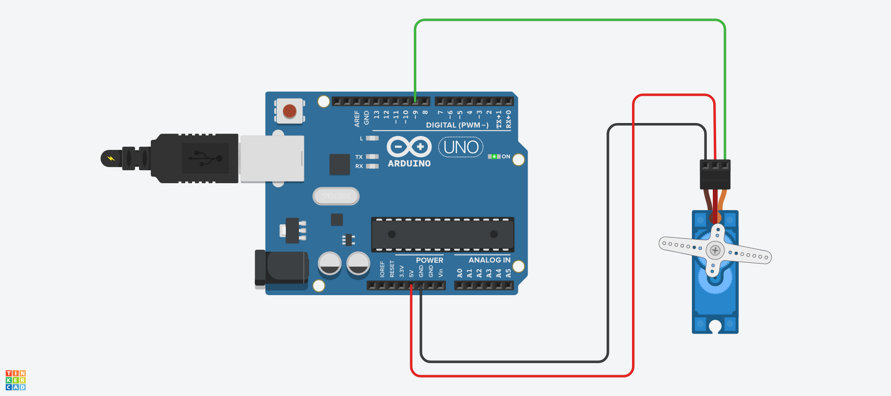

# Servo 예제 1
## 마이크로 서보 동작하기

.

```c
/*
  Sweep
  by BARRAGAN <http://barraganstudio.com>
  This example code is in the public domain.
  modified 8 Nov 2013 by Scott Fitzgerald
  http://www.arduino.cc/en/Tutorial/Sweep
*/

#include <Servo.h>  // 서보를 사용하기 위해 라이브러리에서 불러온다

int pos = 0;        // 서보 위치 값을 저장할 변수(position)을 선언해준다
Servo servo_9;      // 서보_9라는 객체 생성

void setup() {
  servo_9.attach(9, 500, 2500);  // 9번 핀에 서보_9 연결 (펄스 범위 500~2500us)
}

void loop() {
  // 0도에서 180도까지 1도씩 증가하며 이동
  for (pos = 0; pos <= 180; pos += 1) {
    servo_9.write(pos);     // 서보를 pos 위치로 이동
    delay(15);              // 위치 이동을 위한 대기 시간 (15ms)
  }

  // 180도에서 0도까지 1도씩 감소하며 이동
  for (pos = 180; pos >= 0; pos -= 1) {
    servo_9.write(pos);     // 서보를 pos 위치로 이동
    delay(15);              // 위치 이동을 위한 대기 시간 (15ms)
  }
}


```
