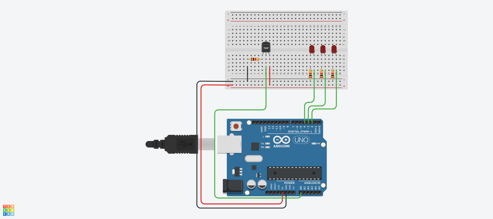
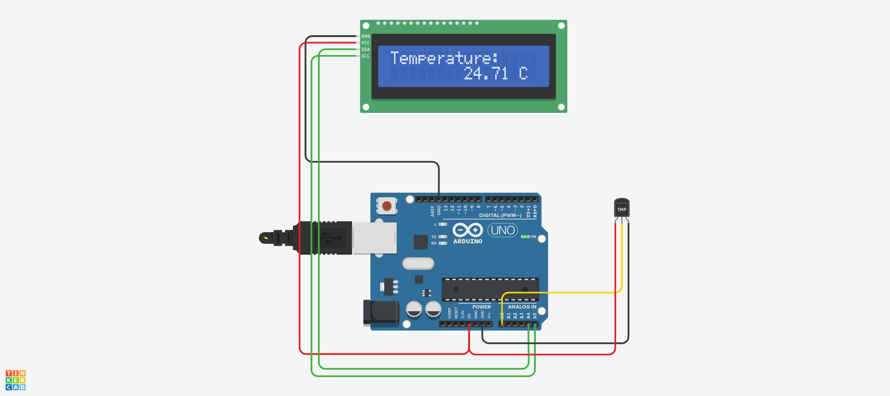

# 온도센서 예제 1
## 온도 센서 TMP36


.

```c
int baselineTemp = 0;  // 기본 온도를 초기화한다.
int celsius = 0;
int fahrenheit = 0;

void setup()
{
  pinMode(A0, INPUT);
  Serial.begin(9600);
  pinMode(2, OUTPUT);
  pinMode(3, OUTPUT);
  pinMode(4, OUTPUT);
}

void loop()
{
  // set threshold temperature to activate LEDs
  baselineTemp = 40;

  // measure temperature in Celsius
  celsius = map(((analogRead(A0) - 20) * 3.04), 0, 1023, -40, 125);

  // convert to Fahrenheit
  fahrenheit = ((celsius * 9) / 5 + 32);

  Serial.print(celsius);
  Serial.print(" C, ");
  Serial.print(fahrenheit);
  Serial.println(" F");

  if (celsius < baselineTemp) {
    digitalWrite(2, LOW);
    digitalWrite(3, LOW);
    digitalWrite(4, LOW);
  }

  if (celsius >= baselineTemp && celsius < baselineTemp + 10) {
    digitalWrite(2, HIGH);
    digitalWrite(3, LOW);
    digitalWrite(4, LOW);
  }

  if (celsius >= baselineTemp + 10 && celsius < baselineTemp + 20) {
    digitalWrite(2, HIGH);
    digitalWrite(3, HIGH);
    digitalWrite(4, LOW);
  }

  if (celsius >= baselineTemp + 20 && celsius < baselineTemp + 30) {
    digitalWrite(2, HIGH);
    digitalWrite(3, HIGH);
    digitalWrite(4, HIGH);
  }

  if (celsius >= baselineTemp + 30) {
    digitalWrite(2, HIGH);
    digitalWrite(3, HIGH);
    digitalWrite(4, HIGH);
  }

  delay(1000); // Wait for 1000 millisecond(s)
}

```
# 온도센서 예제 2
## TMP36 and I2C LCD Display


.


```c
#include <Wire.h>
#include <Adafruit_LiquidCrystal.h>
Adafruit_LiquidCrystal lcd(0);

void setup()
{
  lcd.begin(16, 2);
  lcd.setCursor(0, 0);
  lcd.print("Initializing...");
  lcd.clear();
  lcd.setCursor(0, 0);
  lcd.print("Temperature: ");
}

void loop()
{
  // Read the temperature from the sensor
  int sensorValue = analogRead(A0);

  // Convert the temperature to degrees Celsius
  float temperature = (sensorValue * 5.0 / 1024.0 - 0.5) * 100.0;
  // convert the sensor value to temperature in degrees Celsius

  // Display the temperature on the LCD
  lcd.setCursor(8, 1);
  lcd.print(temperature);
  lcd.print(" C");
}
```


