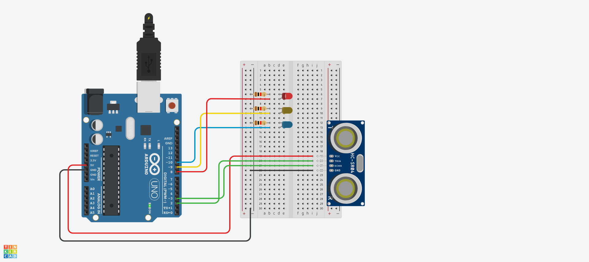
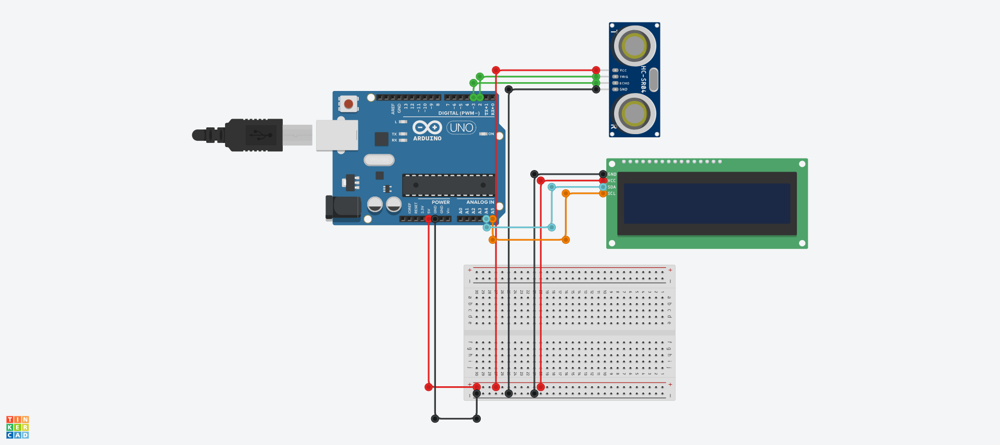

# 초음파 센서 예제1
## 초음파 거리 센서 (4pin)
.

```c
/* 거리의 따라 LED 표시 */

int trig = 2;
int echo = 3;
int RED = 8;
int YELLOW = 9;
int GREEN = 10;

void setup() {
  Serial.begin(9600);
  pinMode(trig, OUTPUT);
  pinMode(echo, INPUT);
  pinMode(RED, OUTPUT);
  pinMode(YELLOW, OUTPUT);
  pinMode(GREEN, OUTPUT);
}

void loop() {
  digitalWrite(trig, HIGH);
  delayMicroseconds(10);
  digitalWrite(trig, LOW);

  // echoPin이 HIGH를 유지한 시간을 저장한다.
  unsigned long duration = pulseIn(echo, HIGH);

  // HIGH였을 때 시간(초음파가 나갔다가 돌아온 시간)을 가지고 거리 계산
  float distance = ((float)(340 * duration) / 10000) / 2;

  Serial.print(distance);
  Serial.println("cm");

  if (distance > 80)  // distance(거리)가 80보다 크면
{
  digitalWrite(GREEN, HIGH);   // GREEN이 연결된 핀에 HIGH 신호(5V)를,
  digitalWrite(YELLOW, LOW);   // YELLOW가 연결된 핀에 LOW 신호(0V)를,
  digitalWrite(RED, LOW);      // RED가 연결된 핀에 LOW신호(0V)를.
}
if (distance > 30 && distance <= 70)
{
  digitalWrite(GREEN, LOW);
  digitalWrite(YELLOW, HIGH);
  digitalWrite(RED, LOW);
}
if (distance > 0 && distance <= 30)
{
  digitalWrite(GREEN, LOW);
  digitalWrite(YELLOW, LOW);
  digitalWrite(RED, HIGH);
}
  
  
  delay(100);
}


```


# 초음파 센서 예제 2

## 초음파 거리 센서 + LCD Display (4pin)

.


```c
#include <Adafruit_LiquidCrystal.h>
#define trigPin 2
#define echoPin 3
long duration;
int distance;
Adafruit_LiquidCrystal lcd_1(0);

void setup() {
  pinMode(trigPin, OUTPUT);
  pinMode(echoPin, INPUT);
  Serial.begin(9600);
  lcd_1.begin(16,2);
  lcd_1.print("Sensor Value :");
}

void loop() {
  digitalWrite(trigPin, LOW);
  delayMicroseconds(5);
  digitalWrite(trigPin, HIGH);
  delayMicroseconds(10);
  digitalWrite(trigPin, LOW);
  duration = pulseIn(echoPin, HIGH);
  distance = duration * 0.034 / 2;
  lcd_1.setCursor(0,1);
  lcd_1.print(distance);
  lcd_1.print("cm - Andrea");
  delay(50);
}

```

